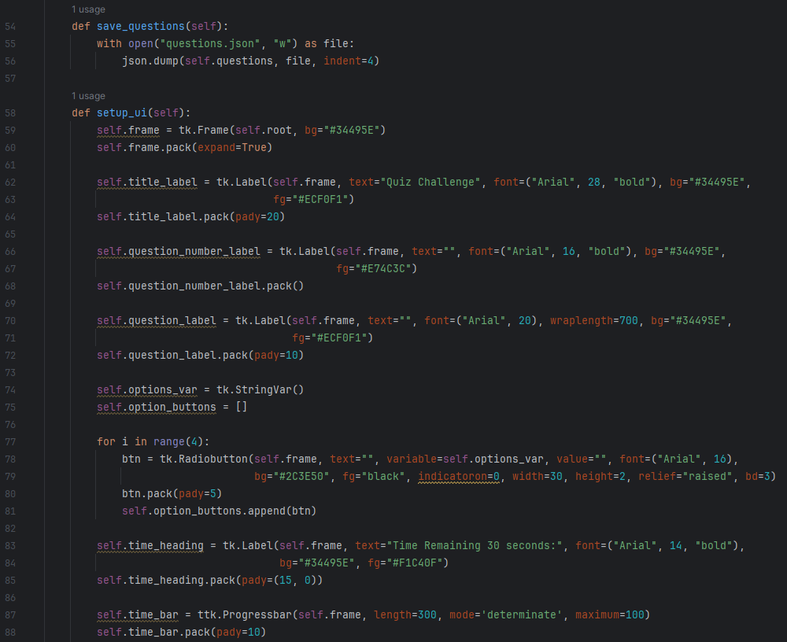
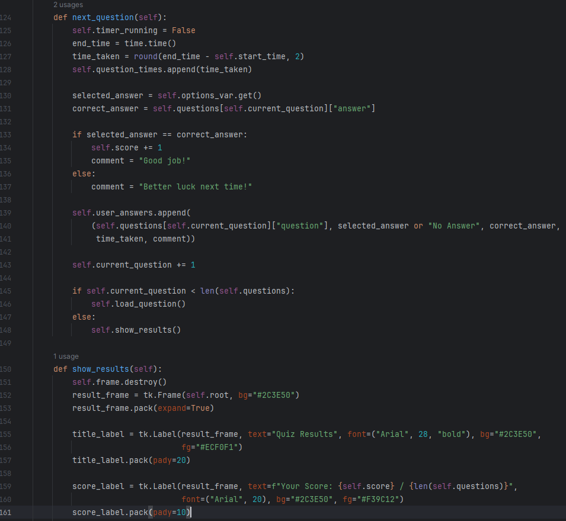
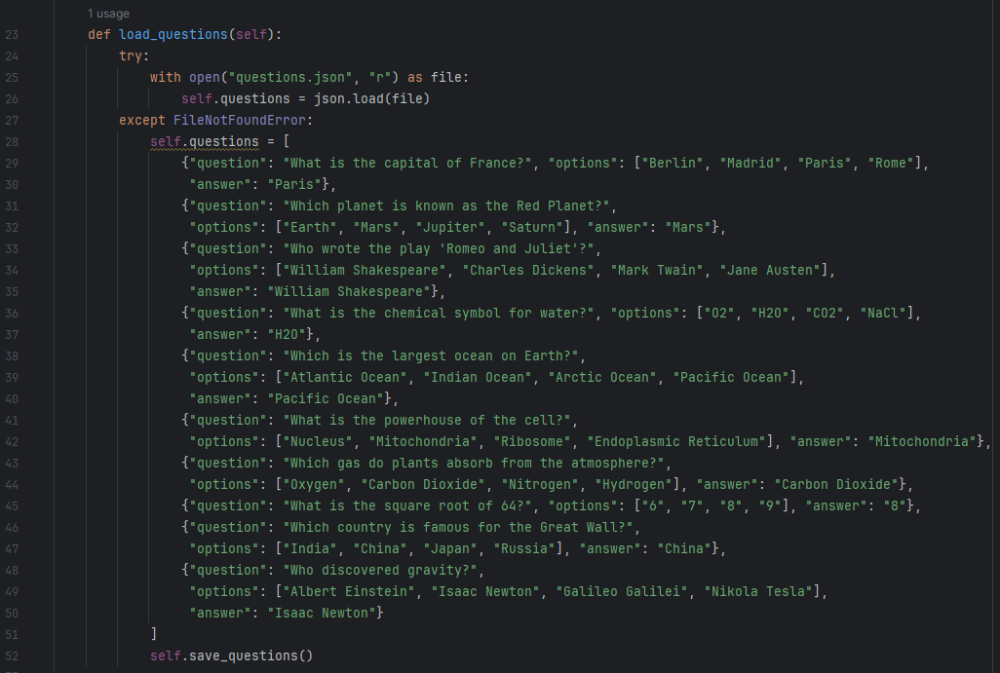
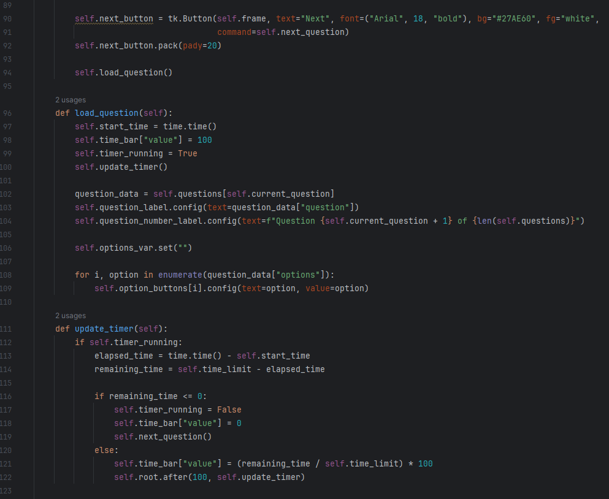
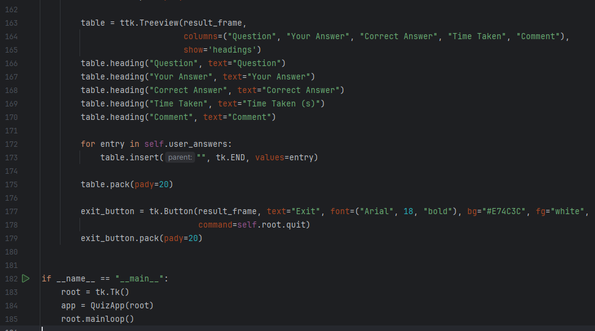
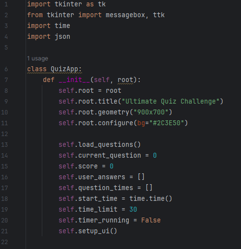
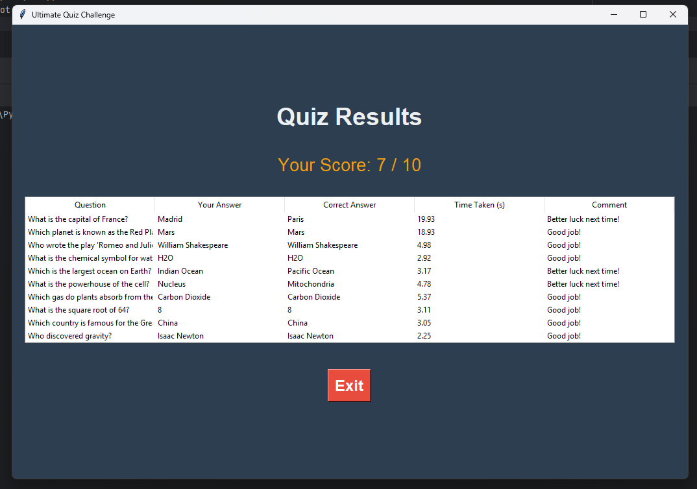
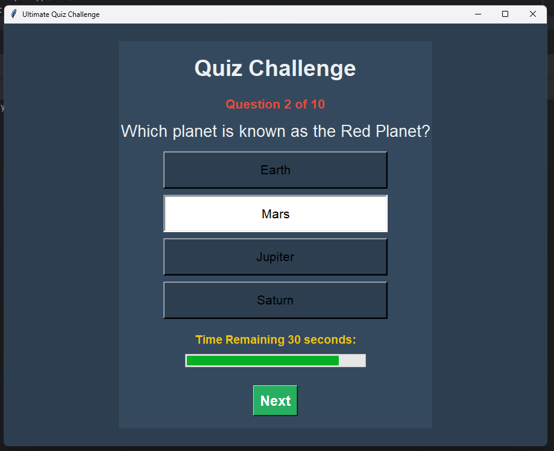
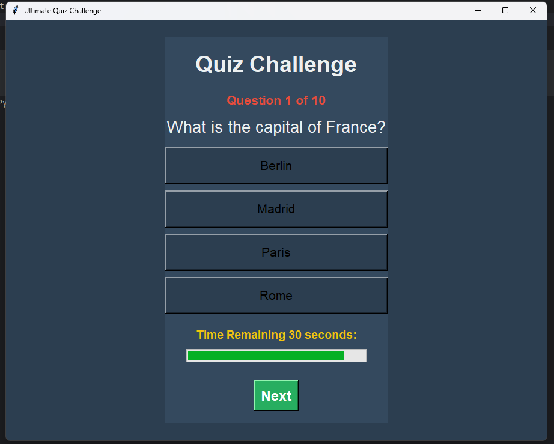

# 🏆 Ultimate Quiz Challenge — Python Desktop Quiz App

> A feature-rich, dark-themed desktop quiz application built with Python and Tkinter, featuring a dynamic progress bar timer, external JSON-based question configuration, and a detailed performance analytics review board.

🎬 **Watch the Demo Video — Ultimate Quiz Challenge:** [Google Drive Demo Video](https://drive.google.com/file/d/1TObZV31VfA3OJ8NPPP1tSPVuODHTMVzF/view)

[](https://www.python.org/)
[](https://docs.python.org/3/library/tkinter.html)
[](https://www.json.org/)
[](LICENSE)

---

## 🌟 Overview

The **Ultimate Quiz Challenge** is a sophisticated, interactive desktop quiz application developed as part of Python learning curriculum. It loads questions from an external `questions.json` database, administers a 10-question multiple-choice challenge with a **30-second time limit per question**, and tracks elapsed time for each answer. 

At the end of the challenge, it replaces the active question layout with a professional **Results Board** built using a Tkinter `Treeview` widget. The board displays a row-by-row breakdown of the user's answers against the correct answers, along with response times and encouragement comments.

This project reinforces critical software engineering principles including:
- Data structure modeling (nested lists of dictionaries)
- File I/O operations and JSON serialization
- Thread-like ticking clocks (`root.after` event schedules)
- Tree/Grid UI widgets (`ttk.Treeview` tables)
- State synchronization in single-frame window transformations

---

## 📸 Screenshots

### 1. Active Question Window (Progress Bar & Timer Active)
<p align="center">
  
</p>

### 2. Selected Option States
<p align="center">
   &nbsp;&nbsp;
  
</p>

### 3. Detailed Results Board (Treeview Grid Analytics)
<p align="center">
  
</p>

### 4. Step-by-Step Question Progression Examples
<p align="center">
   &nbsp;
  
</p>
<p align="center">
   &nbsp;
   &nbsp;
  
</p>

---

## ✨ Features

- **🎮 Dynamic Multiple Choice**: Renders questions with four indicator-free radio buttons (`indicatoron=0`) acting as large, clickable selection pads.
- **⏱️ Progress Bar Timer**: A 30-second countdown runs on every question. The countdown is visually represented by a smooth, yellow `ttk.Progressbar` that updates every 100 milliseconds.
- **⌛ Automatic Timeout**: If the 30-second timer expires before the user clicks **Next**, the app automatically records `"No Answer"`, flags it as incorrect, and transitions to the next question.
- **📂 JSON Persistence**: Questions are stored in and read from `questions.json`. If the file is missing, the application automatically builds one with 10 default general knowledge questions for future modification.
- **📊 Interactive Treeview Grid**: Results are rendered inside a spreadsheet-like data grid showing:
  - **Question** text.
  - **Your Answer** (what the user picked, or `"No Answer"` if timed out).
  - **Correct Answer** (the ground truth).
  - **Time Taken** (precise seconds spent on that specific question).
  - **Comment** (contextual response, e.g. *"Good job!"* or *"Better luck next time!"*).
- **🖤 Sleek Dark Theme**: Rich dark background (`#2C3E50`) with slate-blue question card frames (`#34495E`), green controls (`#27AE60`), and red exit buttons (`#E74C3C`).

---

## 🛠️ Tech Stack

| Component | Technology |
| :--- | :--- |
| **Language** | Python 3.8+ |
| **GUI Library** | `tkinter` & `tkinter.ttk` (Progressbar, Treeview) |
| **Timer / Clocks** | `time` module (delta comparisons) & `.after()` ticks |
| **Data Storage** | `json` serialization (nested dictionaries) |
| **IDE** | PyCharm |

---

## 📁 Project Structure

```
Quiz-Application/
│
├── Quizapp.py             # Main application class — handles UI, state, timers, results
├── questions.json         # External database storing all quiz questions (auto-generated)
├── 6666.docx              # Project documentation with screenshots & activity log
├── screenshots/
│   ├── screenshot_1.png   # Question screen with progress bar timer
│   ├── screenshot_2.png   # Selected option state A
│   ├── screenshot_3.png   # Selected option state B
│   ├── screenshot_4.png   # Final Results Board with Treeview table
│   ├── screenshot_5.png   # Progression — Question 2
│   ├── screenshot_6.png   # Progression — Question 3
│   ├── screenshot_7.png   # Progression — Question 4
│   ├── screenshot_8.png   # Progression — Question 6
│   ├── screenshot_9.png   # Progression — Question 9
│   └── screenshot_10.png  # Progression — Question 10
└── README.md
```

---

## ⚙️ How It Works

```
App Start → load_questions() reads questions.json
                     ↓
              setup_ui() initializes Frame
                     ↓
              load_question():
                - Reset timer = 30 seconds
                - Fill option button labels
                - Start update_timer() loop via .after()
                     ↓
   ┌──────────────────────────────────────────────┐
   │ Taps [Next] or Timer Hits 0?                 │
   │   - Stop update_timer() loop                 │
   │   - Calculate elapsed time = end - start     │
   │   - Check answer correctness                 │
   │   - Append to user_answers list              │
   │   - Load next question                       │
   └──────────────────────────────────────────────┘
                     ↓
         All questions answered?
                     ↓
         show_results():
           - Destroy question frame
           - Create result_frame
           - Populate ttk.Treeview data grid
           - Show final score
```

---

## 🚀 Getting Started

### Prerequisites
- **Python 3.8** or higher (Tkinter, JSON, and Time are standard Python libraries)

### Run the Application

**1. Clone the Repository:**
```bash
git clone https://github.com/AnasQ2003/Quiz-Application.git
cd Quiz-Application
```

**2. Launch the Application:**
```bash
python Quizapp.py
```

The application will start, generate the `questions.json` file automatically, and present the first question.

---

## 💡 Key Concepts Demonstrated

| Concept | How It's Used |
| :--- | :--- |
| **Object-Oriented Programming** | Entire app modeled as a `QuizApp` class with encapsulated state |
| **JSON Serialization** | `json.load()` and `json.dump()` manage question lists |
| **Dynamic Clocks** | `.after(100, self.update_timer)` schedules recursive timer updates |
| **Grid UI (Treeview)** | `ttk.Treeview` tables list tabular result sheets with column headings |
| **Flat Buttons** | `indicatoron=0` transforms radio buttons into solid selection pads |
| **Frame Swapping** | `self.frame.destroy()` dynamically redraws the UI without creating new windows |
| **Time Tracking** | `time.time()` measurements calculate sub-second question speeds |

---

## 🧠 Learning Objectives

> ✅ **Objective**: Enhance the reliability, state complexity, and user-friendliness of GUI programs by incorporating robust timers, file database integrations, and dynamic grid layouts.

**Activities Completed:**
- ✔️ Designed a multi-question quiz using dictionaries nested in arrays.
- ✔️ Integrated local JSON databases to load and modify quiz content dynamically.
- ✔️ Managed recursive timer loops using Tkinter's event queues.
- ✔️ Tracked detailed metrics such as individual response times and score counts.
- ✔️ Swapped layout structures dynamically using frame destruction patterns.
- ✔️ Implemented Treeview spreadsheets to review user performance.

**Key Takeaways:**
- Nested data structures (dictionaries inside lists) are powerful for modeling structured data.
- UI loop-based timers must be decoupled and managed carefully using event schedulers to avoid locking the window thread.
- Treeview components offer a clean, professional way to show complex relational data to users.
- Frame swapping is cleaner than creating multiple window threads, providing a seamless user experience.

---

## 📄 License

```
MIT License

Copyright (c) Quiz Application---2026 AnasQ2003

Permission is hereby granted, free of charge, to any person obtaining a copy
of this software and associated documentation files (the "Software"), to deal
in the Software without restriction, including without limitation the rights
to use, copy, modify, merge, publish, distribute, sublicense, and/or sell
copies of the Software, and to permit persons to whom the Software is
furnished to do so, subject to the following conditions:

The above copyright notice and this permission notice shall be included in all
copies or substantial portions of the Software.

THE SOFTWARE IS PROVIDED "AS IS", WITHOUT WARRANTY OF ANY KIND, EXPRESS OR
IMPLIED, INCLUDING BUT NOT LIMITED TO THE WARRANTIES OF MERCHANTABILITY,
FITNESS FOR A PARTICULAR PURPOSE AND NONINFRINGEMENT.
```

---

## 👨‍💻 Author

**Anas Ahmed Qureshi.** — [@AnasQ2003](https://github.com/AnasQ2003)

---

<div align="center">
  <p>Built with ❤️ by <strong>Anas</strong></p>
  
 <div align="center">

Made with 💧 and a lot of ☕

**⭐ If you found this useful, please star the repository!**

*Stay hydrated. Stay healthy.*

</div>
